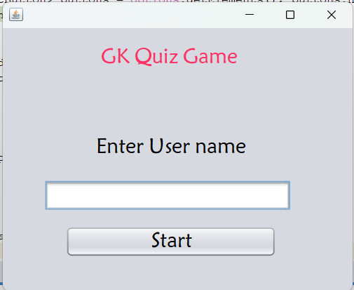
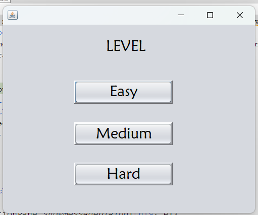
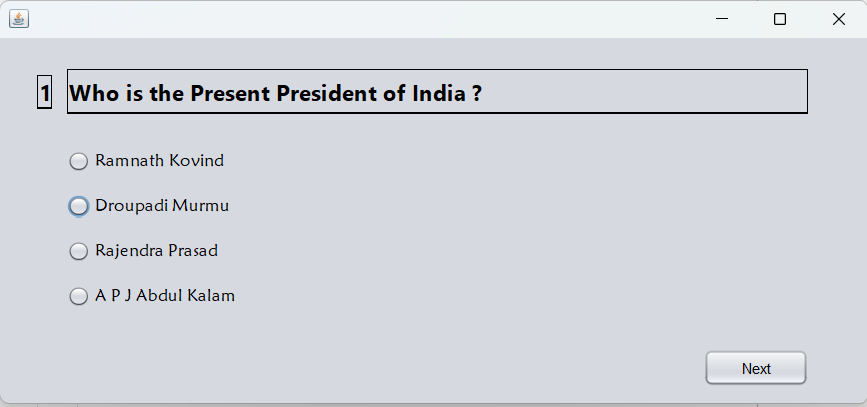
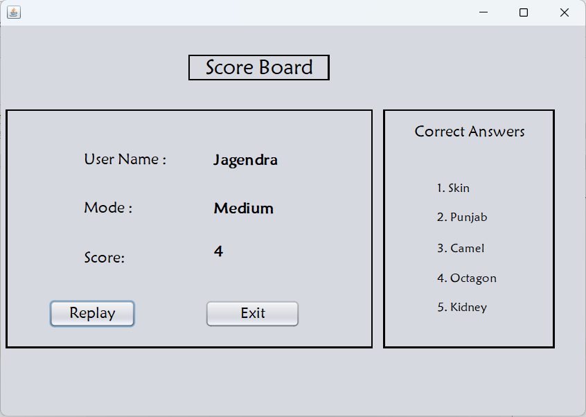

# Gk Quiz Game

----
This is GUI based game made using Java,swing, SQL,NetBeans, Oracle 10g. 

----

## Software Previews

 
 
 
 

## Requirements
following tools are required :

* Netbeans
* ojdbc thin driver
* Oracle 10g

import database.csv to Oracle

## Contributing
Pull requests are welcome. For major changes, please open an issue first to discuss what you would like to change.

Please make sure to update tests as appropriate.
